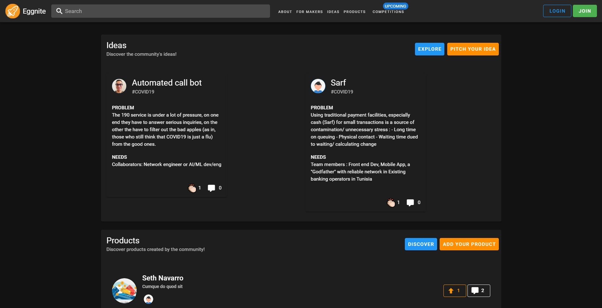

# What is Eggnite

Eggnite is a platform that enables African makers to share their creations with a community of like-minded people. You can think of it as Africa's ProductHunt.

## Why was it created

From a micro-perspective, because I feel like the makers' community is not really valued so most creations (unless an outlier) go unheard of. And because such a solution[1] hadn't existed so far.

From a macro-perspective; In my view, most, if not all, of the current products/solutions are revenue-driven. This approach, by default, corners them into using revenue as their (sole) primary metric. Thing is, in Africa's current state that is the wrong metric to track because it doesn't foster the spirit of experimentation and risk-taking. Rather, it greatly constraints makers to choose only the most profitable alternative.

[2]Reddit, ProductHunt, BetaList etc... (you name it) aren't really meant for African countries. They're mostly aimed at developed countries, so the posted products address a different set of challenges.

## What is the vision behind it

Fundamentally Eggnite is about fostering a community of African makers and giving them the tools they need to further develop their products and maximize their impact on their market.

In this first iteration, the focus is going to be on shining a light on what's currently being built.

## What tech stack is Eggnite built on

It's built on NodeJS. For the frontend I'm using Nuxt/Vue. The backend is powered by Nest, GraphQL and postgres. And it's being hosted on Heroku.
